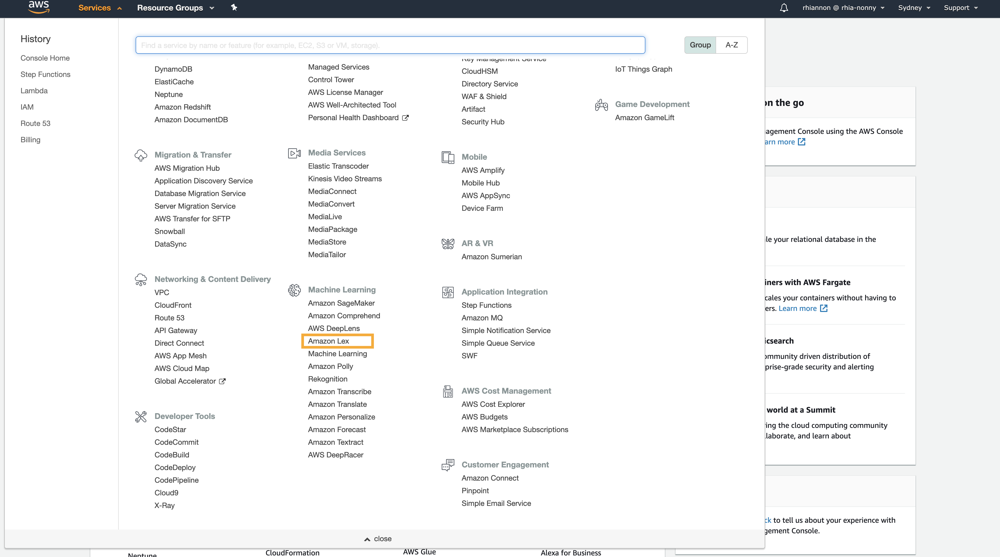
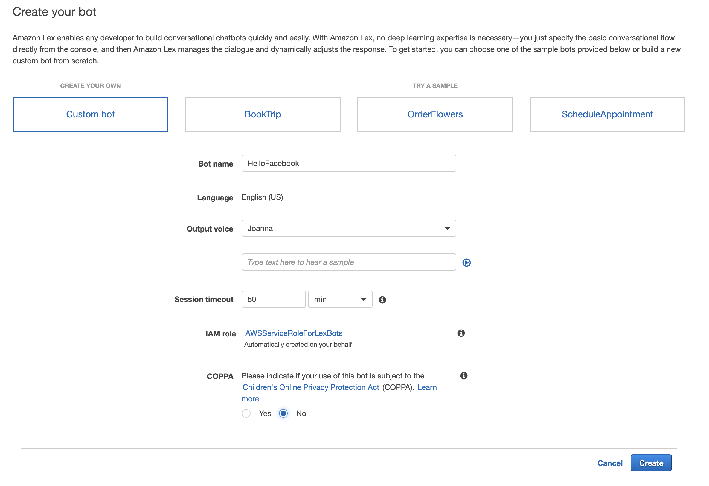
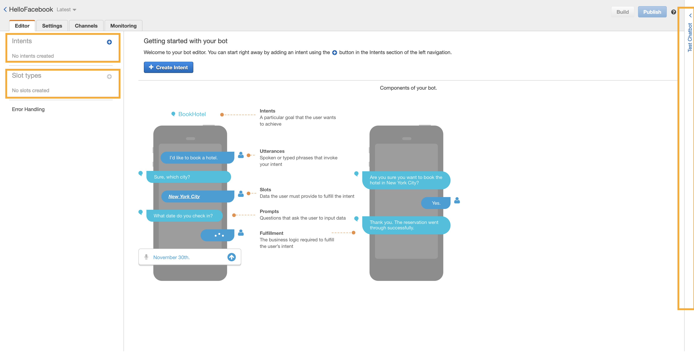
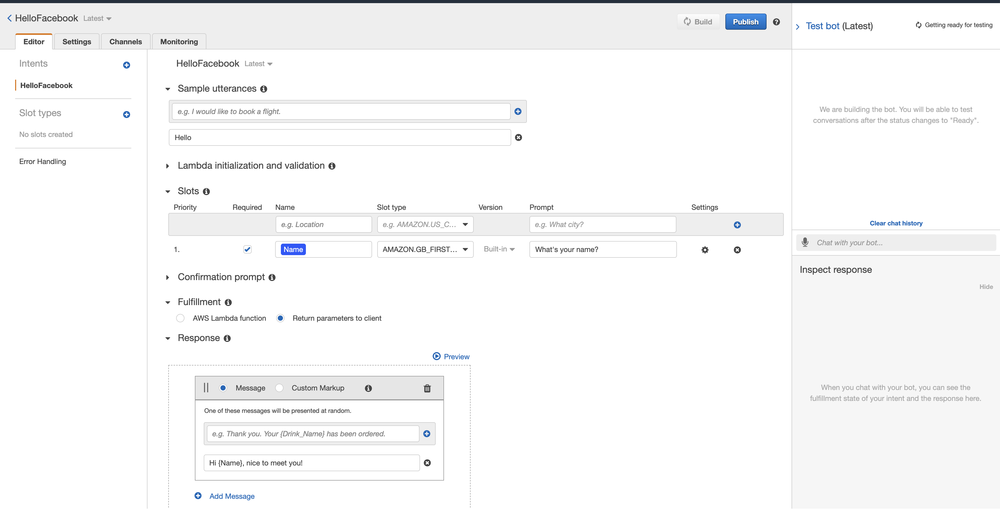
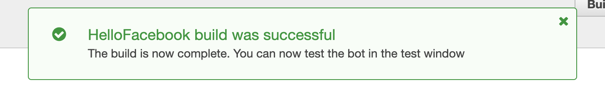
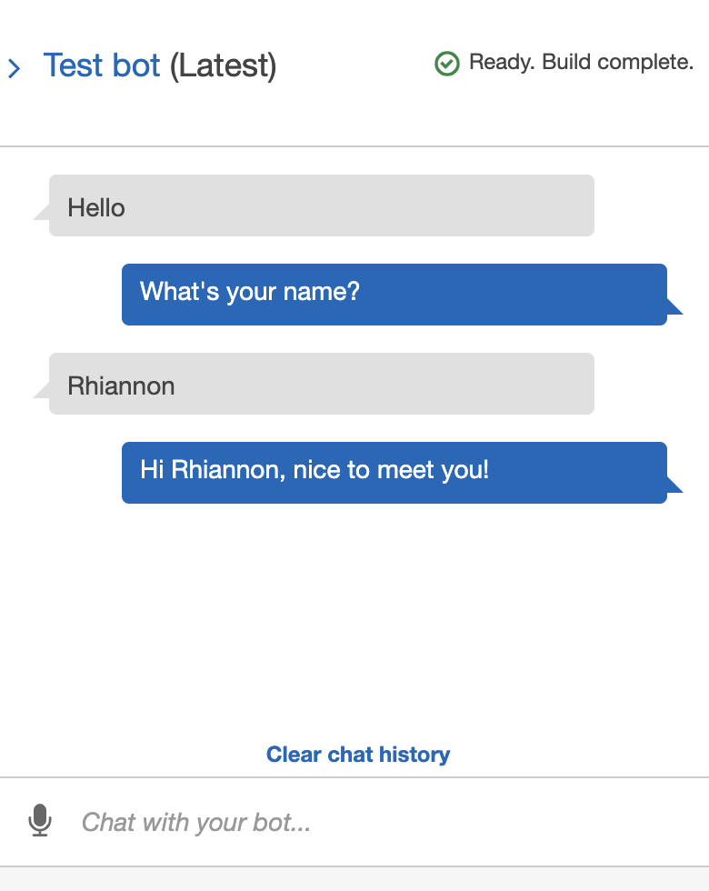

_Want to build a chat bot, but feel you aren't technical enough to give it a go on your own? Hopefully this can help!_

### Who's This For?

I know I can be a bit of a nerd, but I try not to assume too much knowledge when I write this post. 

### What are we going to do? 

We're going to make a really simple greeting chatbot in AWS, and then connect it to a Facebook page and say hello!

Amazon have their Web Services, one of these services is called Lex. 

Lex is a natural language processing service, along with some other cool features I'm going to show you. It's basically, a really helpful service that helps you to make a chatbot. 

Briefly, a chatbot is just what it says on the tin. It's some bit of computer programming (bot) that can chat with you. 

What we're going to do is first use no code, and then if you're excited to do more, you can go on to 

### Finding Lex in the Console

Login to the [AWS Console](https://console.aws.amazon.com/console/home), you may need to create an account to do this. 

### Where's Lex?

There ways to get there, click on the *Services* section in the top menu bar, or in the console you'll see it under Machine Learning or you can search for it. 

### Create a Bot

Once you're in with Lex, you'll see a splash screen, or, if you've done this before a list. Either way you'll find a  button in there somewhere!

### Lex Console

### Add in the Basics

### Build Successful!

### Hello \{Name}, nice to meet you!

