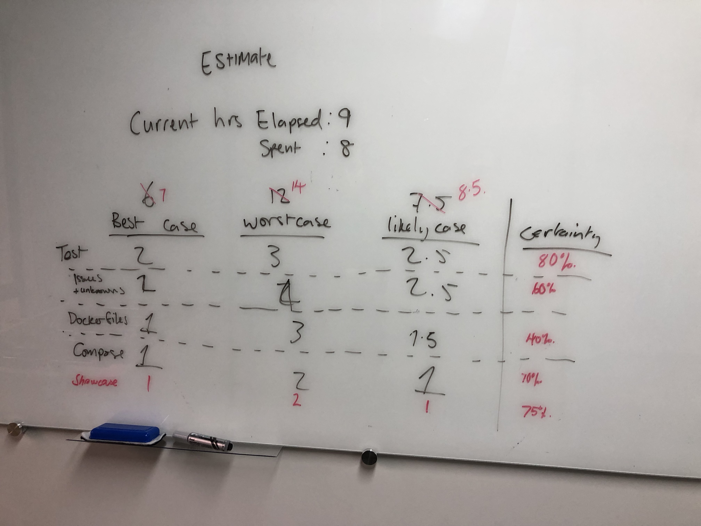

_Started a new job, and with some time before the first full-time client engagement kicked off, what better to do than to learn some Docker! A brief summary of lessons learnt in professional project management._

### Background
I started my new job! I'm now a Technical Consultant in the Cloud and Automation practice at IntegrationQA. I've been with them for about a month now.

As part of my induction process, I was given an internal project to enable me to develop some new skills and get familiar with the team's working practices prior to joining my first client engagement. My team leader gave me the option of picking any new skill I wanted.

#### What did I pick?

- *Docker*!

#### Why?

As a cloud analyst, my focus has been on developing cloud native applications and I'd always wanted to have a go at learning more about Docker, but I had never been assigned to a project that allowed me the extra time needed to learn at my own pace.

#### Story time: Introduction

In this post I'm going to explain what I have learned about running projects successfully in a professional environment from this two-week micro-project.

I hope you can learn from my lessons; follow me along through my next posts and I'll also touch on the technical content.

### Purpose of this Project
Docker From Scratch is all about me learning Docker.

You guessed it, *from scratch*.

At first, I thought that there wasn't too much that I needed to do in order to understand Docker. My first impressions might have been wrong.

The goals of the project were:
    - To have a go at Docker-ising an application with multiple components.
    - Build the application to Docker-ise.

### Starting the Project
> The project was simple. It was to learn! Simple objective, right?

*WRONG!*

The first thing I learned during my project was **requirements** are best defined earlier! This was something that I hadn't caught on to until later in the project, after the third or fourth changed "requirement" lead to even more scope creep.

### Managing the Scope

This was an internal project, so my client was my manager, but regardless of that: They were a tough client.

Throwing up new ideas, changing requirements, adding in standards.

When you have a client, you need to be able to coach them and help them to manage their requirements. Change is likely as you progress, but you should always be mindful of scope creep!

I looked up *Scope creep*, and it's defined as "a dreaded thing that can happen on any project, wasting money, decreasing satisfaction, and causing the expected project value to not be met." (PMI, 2009).

I'd say that's accurate.

### Estimates
> Estimates aren't for the Faint of Heart

Or rather, estimates are about how much you *know yourself* and how much you *know the task*.

I started with the brief, and felt like the project would be maybe a week, as we had a week till the next client project kicked off.

That would be all the time I had to play with Docker From Scratch.

About two days in, after taking a day to build the boilerplate app, and a brief look at databases; I started to look into the API server. My manager asked me what my estimate would be now.

We started a table on the whiteboard:

And then after a few back and forths we added that column on the far right - _certainty_. This was about how confident I felt in the accuracy of my estimate.

> It's hard to know how long an activity takes the first time around.

When we pushed paused on the Docker From Scratch project it had already taken longer than the 14 day worst case estimate.

### Keep Track of What You're Learning

When you take on a learning project, make sure you keep track of what you're learning.

If that's through commit messages, that's fine. Better still, I would suggest that you keep a local file adjacent to your README. You can commit it too, but it's more for you than anyone else.

As you're going along with your project, keep a log of useful commands, websites (_if you remember_), and add in a bold heading with **"Key Learning Points"**, where you can start a list of notes for yourself.

In my project, I had points like:
1.  _Git_ - Use `git remote prune origin` when suffering with dead references in origin.
2. REST APIs should return a representation of any object created when a POST method is used.

I'll go over the technical side to those learning points later in the _Docker From Scratch_ series.

### Bits and Pieces I Picked Up

Every project you run should be run like a professional project. This was a big thing that I think would have improved things significantly. Knowing the practices and putting them into action are two different things. But it is well worth it.

- Getting your requirements nailed down early leads to better management of scope and limits potential scope creep.

- Estimates are helpful for time-lining a project, but don't be afraid to put a bigger number than you think sounds right. It's better to deliver earlier than expected than later. So over-estimating the time required is better than not completing your intended task(s).

- As technologists, we're always learning and it's important to remember that. Learn from experiences and enjoy the journey, don't beat yourself up for not being 100% right from the start.

- Keep track of the things you learn along the way, that way, when you look back you can see all your improvements. 

- Failures aren't always failures. If something fails, take a step back, reflect, do a retrospective, and next time you come to the same situation you'll know what to do differently. That's the magic of _Continuous Improvement_.

### Next Up

I'll be writing up the technical aspects of this project next, so if you want to learn about what I did and how to learn Docker from Scratch follow along.

_Feel free to message me at @fletchergallop on Twitter for any questions or comments! - Thanks!_

___

#### Sources

1. [PMI Scope Creep](https://www.pmi.org/learning/library/top-five-causes-scope-creep-6675)
