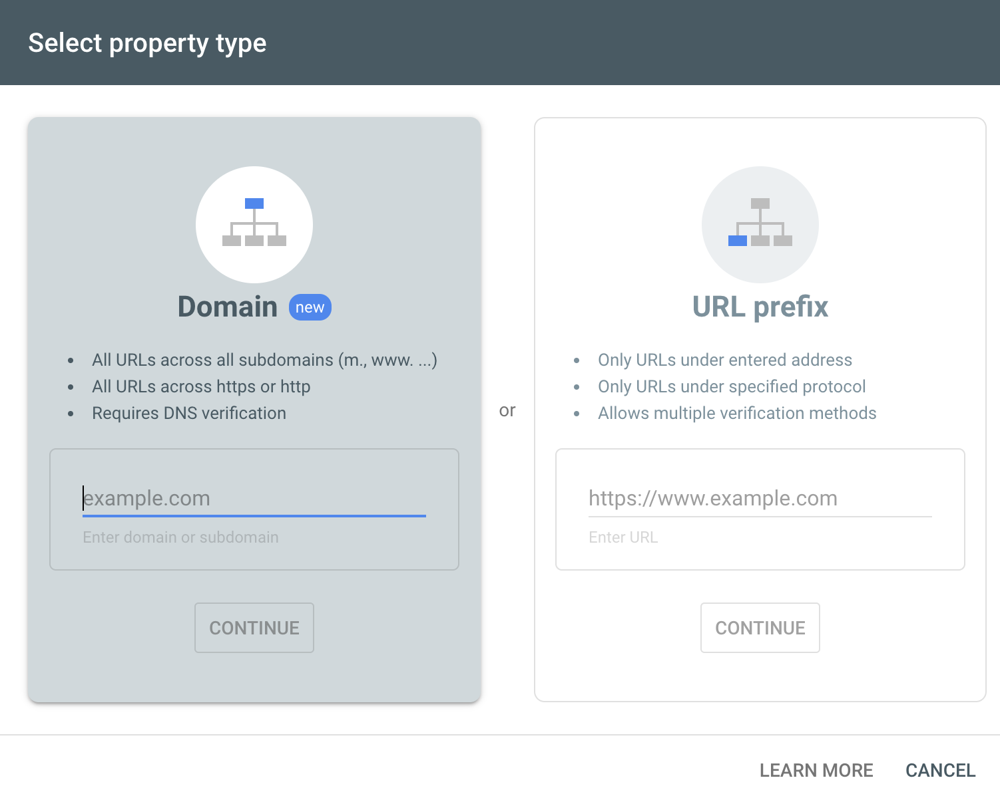
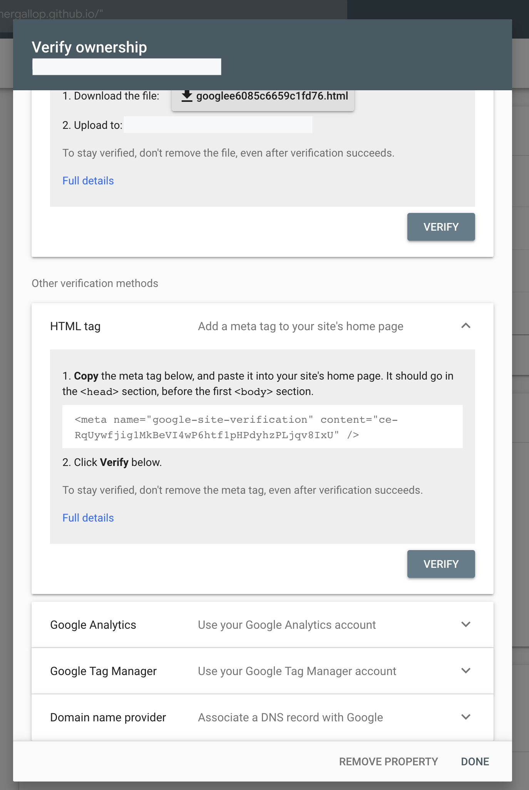
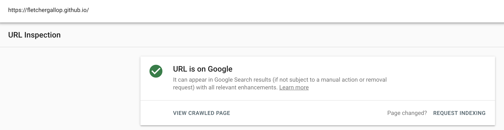

_Adding Google Analytics and Google Search to your static Jekyll Blog._

## Why Would I?

Sometimes writing a blog feels a bit like talking into the void. But when you add Google Analytics and Google Search Console to the mix, you can get numbers to tell you either way.

It might not be good, but you'll have the data!

So this is a quick guide on how to add Google Search indexing and Google Analytics to a Jekyll blog.

## Google Search Console

When you get to Google Search Console, first thing you'll need to do is verify that you own the property. 



You'll want to click on the option to the right if you're using a Jekyll static site like myself. The option to the left requires DNS verification, which simply isn't possible when being hosted by a service like GitHub Pages. 

Once you've selected that, it will generate an HTML file for you, but you want to instead, scroll down and select the HTML tag option.



You'll want to copy that text. 

Then, pull out the text given in the `content` and instead add that to your _config.yml file in Jekyll. And in your default layout add the meta to your html header.

`_config.yml`
```yaml
google_verify: ce-RqUywfjig1MkBeVI4wP6htf1pHPdyhzPLjqv8IxU
```
`default.html`
```html
<head>
...
<meta name="google-site-verification" content="{{ site.google_verify }}">
...
</head>
```

You'll want to request indexing on your webpage, this is done by entering your URL into the search bar at the top and then selecting **Request Indexing**.



This one requires a little patience, indexing of your website can take days and sometimes weeks to happen. 

## Google Analytics

This is also straightforward. First, go to [Google Analytics](https://analytics.google.com/analytics/web/). Then, sign up. Create an account name and add in all your details. 

Once you've done this, click  and copy your tracking ID. 

This will then go into your `_config.yml` file. 

```yaml
google_analytics: UA-2110908-2
```

You'll also need to add the following to your `default.html`
```html
    <!-- Global site tag (gtag.js) - Google Analytics -->
    <script async src="https://www.googletagmanager.com/gtag/js?id=UA-138395101-1"></script>
    <script>
      window.dataLayer = window.dataLayer || [];
      function gtag(){dataLayer.push(arguments);}
      gtag('js', new Date());

      gtag('config', 'UA-2110908-2');
    </script>
```

Once you've done that, push all your changes, and have a go visiting your page and seeing the updates in Analytics. 