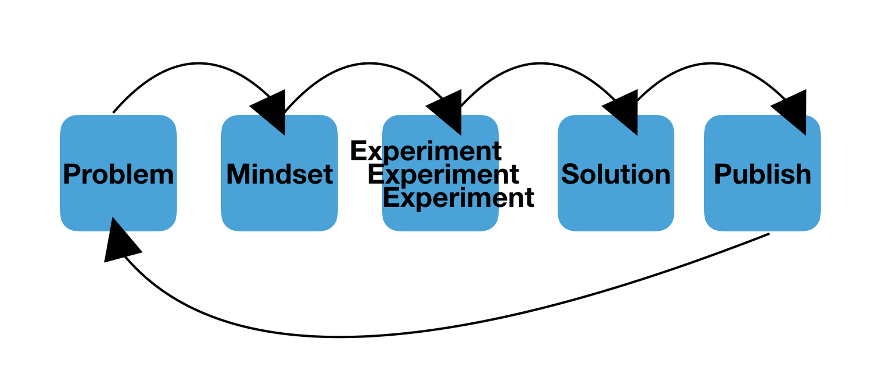

*There's a lot to learn in Tech, so take your time, be smart about how you tackle new things. Iterate on your learning, and more importantly, prototyping is your best friend.*

## Why listen to me?
I'm relatively new to the industry, but more than that, I'm new to most of the things I work with at one point. I spent the best part of last year working on Proof Of Concepts (PoCs), greenfield projects and technologies I'd only heard the name of before being thrown in to use them. 
I've had to learn a lot, and learn quickly, whilst I enjoy learning, I hate failing and really struggle to remember I don't have to do something perfectly first time. 

## How do I do it?

I have a multi-step approach to learning:

1. Problem 

2. Mindset

3. Knowledge

4. Experiment aka Prototype

5. Solution

6. Repeat

## What do I mean by a prototype?

Prototyping is often used in engineering, generally not the software kind, but often elsewhere. Especially when it comes to civil structures, making a mini bridge and load-testing that is easier than building full-size only to realise it's not up to scratch. 

A prototype according to Wikipedia is:

> A prototype is an early sample, model, or release of a product built to test a concept or process or to act as a thing to be replicated or learned from

This is very similar to a proof of concept as you might know them. But it's an emphasis on learning from that is closer to what we want. 

With PoCs there's often this idea that once you've done it you show that the idea either works or doesn't and that's it. You throw it away (spike), or fill in the bones (walking skeleton). 

But with prototypes you focus on what you learn from it, not only do you learn more about the concept you're creating, whether it's viable, but you also focus on the learning you have. 

## The Process

All the steps I've listed above 1 through 6 are important. 
 
### Problem

This can be a multitude of things, a plethora of problems. But typically I like to structure problems as either something I want to be more familiar with or as an application I'm needing to build. 

a. ***"I want to learn Terraform so I can deploy to AWS in an automated way"***

b. ***"I need to create a React Native app that updates state on a DynamoDB item change"***

a) is a *learning* problem, b) is a *concept* problem as far as I define them.

It helps to start with a clear problem, the further you can narrow the scopes the better. Bearing in mind, you can iterate and increase the scopes later. 

### Mindset

There aren't many barriers to learning new things, but one major one is you.

Often I found that a major reason I didn't do new things was because I was:
- scared of failing
- unsure where to start
- thought there was too much to start
- didn't have enough time

All these things are your brain getting in the way. What you need to do is:

- remind yourself that failure isn't the end, it's still an outcome, and you can try again
- start with a project, something you can really prototype, this gives you a good structure and gives you a good starting point
- time-box yourself so you don't stray

Most important of those, don't be afraid to get it wrong. The joys of technology available to us these days is we can tear it down and try again. Version control your code. Use resource tags so you can tear down your prototype. Create a clean workspace for just this purpose. 

### Knowledge

Learning time! 

Now, now you are a sponge. Look at you, all absorbent, ready to soak up knowledge. 

Typical resources:
- Blogs
- Articles
- White-papers
- API Documentation
- Other people's projects on GitHub
- Video Tutorials (eg YouTube, Udemy, ACloudGuru)
- Twitter threads 

Knowing how you learn can be helpful, if you learn by reading, doing, listening, then use the resource that best suits that. 

Knowledge can be an iterative process, or a full immersion, it depends on your time-box. If you're limited, then learn only as much as you need to get the prototype done. Learn about the concepts, how they fit together. Start with an example, or "getting started" tutorial. 

### Experiment

PROTOTYYYYPES. Joyful, joyful prototypes. 

Well, maybe not always joyful as sometimes they can be frustrating and not work. But that's the thing, you can just try again a different way. Go away learn some more, try a different approach. 

Remind yourself that if a prototype doesn't work, that's *okay*. Pull from it anything you've learnt. You'll likely have written some code, found some packages/libraries to use, done a bunch of debugging. All that is invaluable stuff not to be thrown away just because your application didn't work. 

Keep trying new things, pulling out new knowledge from each as you go along, if you keep hitting a wall - don't forget you can ask for help. 

### Solution

You've worked hard to get to this point. Now it's time to showcase what you've learnt and what you've been working on. 

Once you've tried your hand at a few prototypes this stage is more about decision making. Using your best judgement, knowledge of the options and your context to decide what suits your needs best. It can be that you just make the thing that worked best, or maybe you figure that the way you want to tackle this isn't what you'd first picked. All valid options. 

Best way is to use a decision matrix, score your options, have some acceptance criteria already written before you start and then you can use those to decide if your solution is fit-for-purpose.

### Repeat

Iteration is key to #DevOps. You have a solution, but in step 1 - Problem we whittled down our problem to the very minimum it could be. Now it's time to expand. If you're doing TDD, then add in some more tests. Add in some more context and scenarios to your problem. Maybe expand your application. 

But do so in nice achievable steps, this is a key aspect of SCRUM that we're bringing in now. You may have picked up on the similarities. Essentially what I'm describing here is sprints! 

We live in a state of forever having new problems to solve, applications to build, things to learn. But if you step back, take a breath, and approach everything in a methodical way it gets easier and easier to take things in your stride.

Remember, keep learning, never be afraid of getting things wrong, and prototype until you have something that works, even if that's your own capabilities! 

### Further

If you want to know more about how I go through this process, message me on twitter [@FletcherGallop](https://twitter.com/FletcherGallop). I'm happy to answer any questions or if requested I can write more posts!

*Thanks for reading, and don't forget, you can contact me on Twitter or LinkedIn if you have any questions or comments.*
